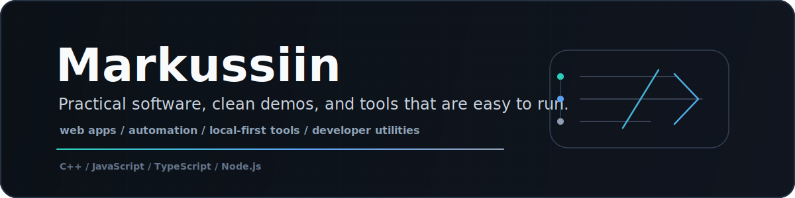

<p align="center">
  
</p>

I make useful software, experiments, automation, tools, and small apps. I like projects that are practical, clean, and easy to run.

**Languages**

```txt
C++ | JavaScript | TypeScript
```

**I Work With**

`Node.js` `GitHub Actions` `Vite` `Next.js` `CLI tools` `static analysis` `web apps` `local-first tools`

**What I Build**

- Small tools that remove annoying manual work.
- Web apps and dashboards for focused workflows.
- Experiments that turn into useful projects when the idea is worth keeping.
- Developer utilities, automation, and repo-quality checks.

**Current Direction**

More polished open-source projects, better demos, cleaner READMEs, and software that feels useful from the first run.

**Links**

[Repositories](https://github.com/Markussiin?tab=repositories)
